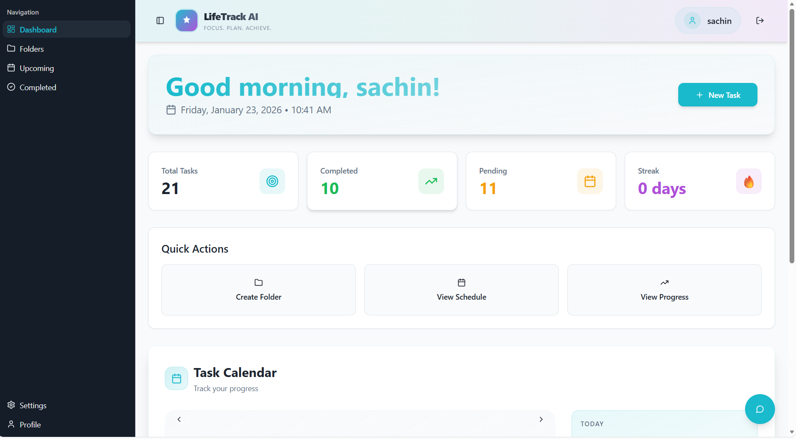
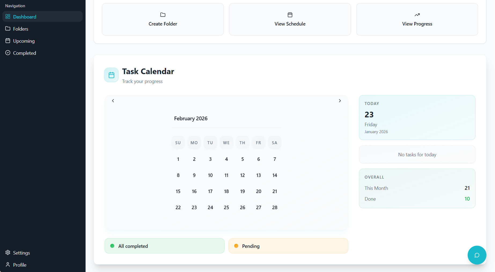
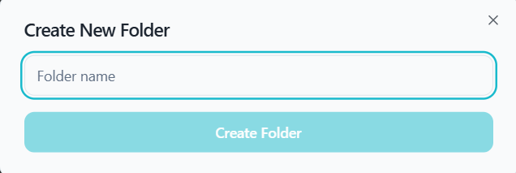
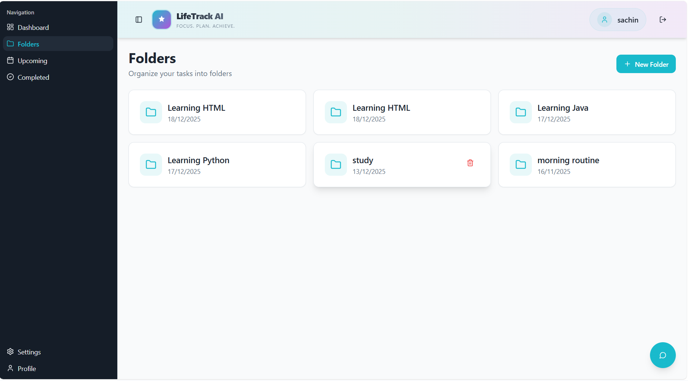
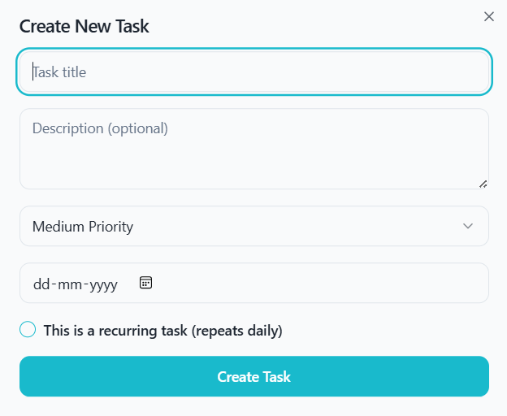
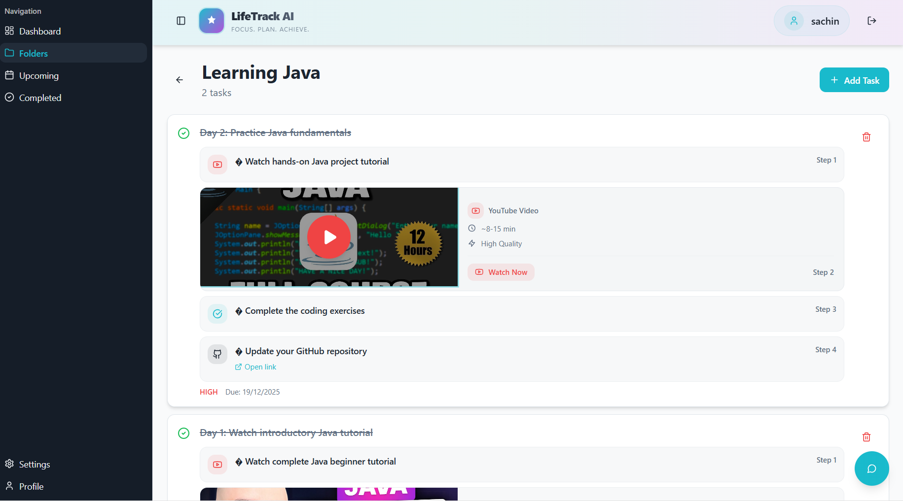
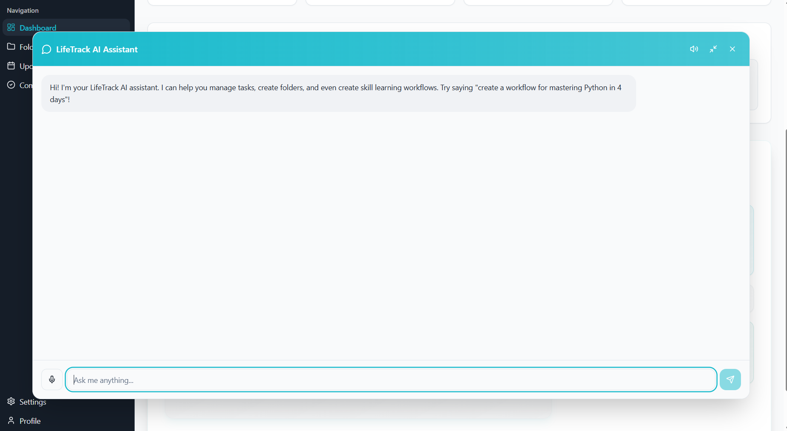
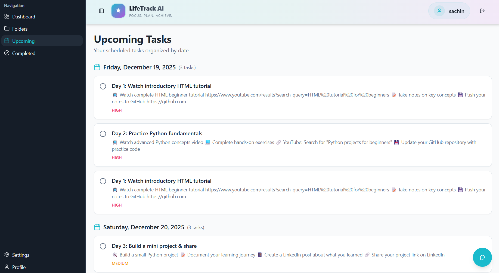
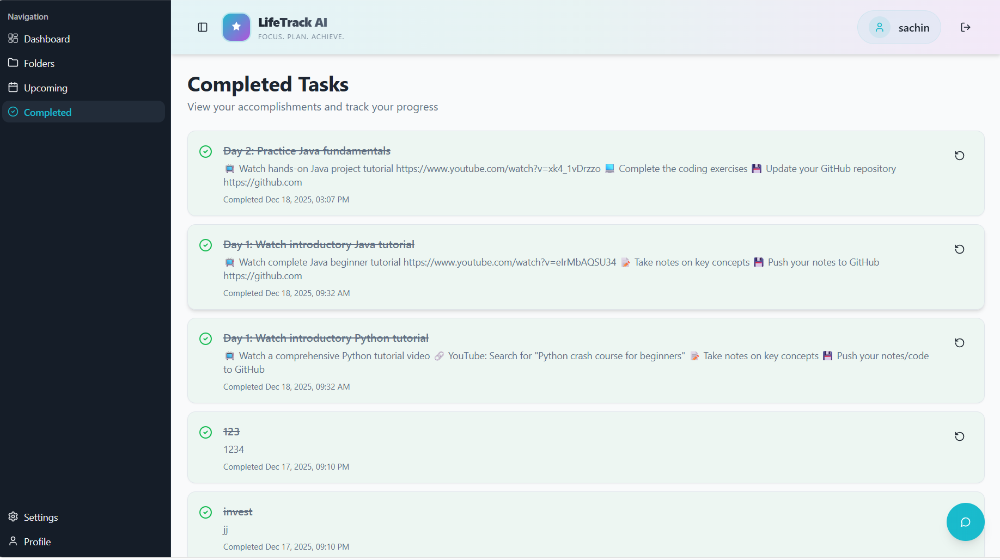

# LifeTrack AI

A modern, intelligent life and task management application built with React, TypeScript, and AI-powered features. LifeTrack AI helps you organize your life, track your goals, and get AI-assisted guidance through an interactive chatbot.

## 📋 Table of Contents

- [Features](#features)
- [Tech Stack](#tech-stack)
- [Getting Started](#getting-started)
- [Project Structure](#project-structure)
- [Usage](#usage)
- [Configuration](#configuration)
- [Development](#development)
- [Deployment](#deployment)

## ✨ Features

- **AI-Powered Chatbot**: Get intelligent assistance with your tasks and goals
- **Task Management**: Create, organize, and track tasks with detailed status tracking
- **Folder Organization**: Organize tasks into folders for better structure
- **Dashboard**: Beautiful, responsive dashboard for quick overview of your tasks
- **Task Categories**: View tasks by status (Upcoming, Completed)
- **User Authentication**: Secure login and registration system
- **User Profiles**: Customize your profile and preferences
- **Settings Management**: Adjust application settings to your needs
- **Dark/Light Theme Support**: Choose your preferred theme

### Dashboard Overview


*Main dashboard with sidebar navigation, task overview, and intuitive layout*


*Extended dashboard view showing additional features and task organization*

## 🛠️ Tech Stack

### Frontend
- **React 18.3**: UI library
- **TypeScript**: Type-safe JavaScript
- **Vite**: Fast build tool and dev server
- **Tailwind CSS**: Utility-first CSS framework
- **Shadcn/ui**: High-quality React components
- **React Router v6**: Client-side routing
- **React Query**: Data fetching and caching
- **React Hook Form**: Efficient form management
- **Zod**: Runtime schema validation
- **Lucide React**: Beautiful icons
- **Recharts**: Chart and visualization library

### Backend & Services
- **Supabase**: PostgreSQL database and authentication
- **Supabase Edge Functions**: Serverless functions
- **Supabase Chat Function**: AI chatbot integration

### Development Tools
- **ESLint**: Code linting
- **PostCSS**: CSS processing
- **Autoprefixer**: Vendor prefixing

## 🚀 Getting Started

### Prerequisites
- Node.js 18+ or Bun
- Git
- Supabase account

### Installation

1. **Clone the repository**
   ```bash
   git clone https://github.com/yourusername/lifetrack-ai.git
   cd lifetrack-ai
   ```

2. **Install dependencies**
   ```bash
   bun install
   # or
   npm install
   ```

3. **Setup environment variables**
   Create a `.env.local` file in the root directory:
   ```env
   VITE_SUPABASE_URL=your_supabase_url
   VITE_SUPABASE_ANON_KEY=your_supabase_anon_key
   ```

4. **Start the development server**
   ```bash
   bun run dev
   # or
   npm run dev
   ```

5. **Open in browser**
   Navigate to `http://localhost:5173`

## 📁 Project Structure

```
src/
├── components/          # React components
│   ├── ui/             # Shadcn/ui components
│   ├── AppSidebar.tsx  # Main sidebar navigation
│   ├── Chatbot.tsx     # AI chatbot widget
│   ├── DashboardLayout.tsx  # Dashboard layout
│   └── ...
├── pages/              # Page components
│   ├── Dashboard.tsx   # Main dashboard
│   ├── Login.tsx       # Login page
│   ├── Register.tsx    # Registration page
│   ├── Folders.tsx     # Folders management
│   ├── Upcoming.tsx    # Upcoming tasks
│   ├── Completed.tsx   # Completed tasks
│   └── ...
├── contexts/           # React context providers
│   └── AuthContext.tsx # Authentication context
├── hooks/              # Custom React hooks
│   └── use-toast.ts    # Toast notifications
├── integrations/       # External service integrations
│   └── supabase/       # Supabase client and types
├── lib/                # Utility functions
│   └── utils.ts        # Helper utilities
├── api.js              # API endpoints
├── App.tsx             # Main app component
└── main.tsx            # Entry point
```

## 💻 Usage

### Authentication

Users can register for a new account or login with existing credentials:

- Navigate to `/login` for existing users
- Navigate to `/register` for new users
- Password recovery available via `/forgot-password`

### Managing Tasks

1. **Create a Folder**: Use the Folders page to organize your tasks
2. **Add Tasks**: Create tasks within folders with descriptions and due dates
3. **Track Progress**: Update task status as you progress
4. **View Dashboard**: See all tasks at a glance on the dashboard

#### Folder Management


*Create and organize folders for better task categorization*


*View and manage your folder hierarchy*

#### Task Management


*Create tasks with detailed information and assign them to folders*


*Organize and view tasks within their folder context*

### AI Chatbot

The chatbot widget provides intelligent assistance:

- Get task suggestions and reminders
- Ask questions about your tasks and goals
- Receive AI-powered recommendations
- Real-time chat interface


*Interactive AI chatbot for intelligent assistance and task guidance*

### Task Views

- **Upcoming**: View all upcoming tasks with deadlines
- **Completed**: See your completed tasks and achievements
- **Dashboard**: Overview of all tasks with status breakdown

#### Upcoming Tasks


*View and manage all upcoming tasks with due dates and priorities*

#### Completed Tasks


*Track your progress and view completed tasks*

## ⚙️ Configuration

### Supabase Setup

1. Create a Supabase project at [supabase.com](https://supabase.com)
2. Create tables for tasks, folders, and user data (migrations are included)
3. Setup authentication providers
4. Configure Row Level Security (RLS) policies
5. Deploy Edge Functions for the chatbot

### Environment Variables

```env
VITE_SUPABASE_URL=        # Your Supabase project URL
VITE_SUPABASE_ANON_KEY=   # Your Supabase anonymous key
```

## 🛠️ Development

### Available Scripts

```bash
# Start development server
bun run dev

# Build for production
bun run build

# Build for development
bun run build:dev

# Run linter
bun run lint

# Preview production build
bun run preview
```

### Code Style

- ESLint is configured for code quality
- TypeScript for type safety
- Follow component naming conventions
- Use functional components with hooks

### Component Development

All UI components are built using Shadcn/ui on top of Radix UI primitives. Components are located in `src/components/ui/`.

## 📱 Pages Overview

| Page | Path | Description |
|------|------|-------------|
| Dashboard | `/` | Main overview of all tasks and status |
| Login | `/login` | User authentication |
| Register | `/register` | New user registration |
| Folders | `/folders` | Task folder management |
| Folder Detail | `/folders/:id` | View tasks within a folder |
| Upcoming | `/upcoming` | Upcoming tasks view |
| Completed | `/completed` | Completed tasks view |
| Profile | `/profile` | User profile management |
| Settings | `/settings` | Application settings |

## 🚀 Deployment

### Building for Production

```bash
bun run build
```

The build output will be in the `dist/` directory.

### Deployment Options

- **Vercel**: Zero-config deployment for Vite apps
- **Netlify**: Connect your GitHub repo for auto-deployment
- **Docker**: Container deployment
- **Traditional Hosting**: Use any static file hosting service

### Pre-deployment Checklist

- [ ] Environment variables configured
- [ ] Supabase database migrations applied
- [ ] Edge Functions deployed
- [ ] Authentication providers configured
- [ ] Database RLS policies set
- [ ] Build tested locally (`npm run build`)

## 📚 Additional Resources

- [Vite Documentation](https://vitejs.dev)
- [React Documentation](https://react.dev)
- [Tailwind CSS Documentation](https://tailwindcss.com)
- [Shadcn/ui Documentation](https://ui.shadcn.com)
- [Supabase Documentation](https://supabase.com/docs)
- [React Router Documentation](https://reactrouter.com)

## 🤝 Contributing

Contributions are welcome! Please feel free to submit a Pull Request.

1. Fork the repository
2. Create your feature branch (`git checkout -b feature/AmazingFeature`)
3. Commit your changes (`git commit -m 'Add some AmazingFeature'`)
4. Push to the branch (`git push origin feature/AmazingFeature`)
5. Open a Pull Request

## 📝 License

This project is licensed under the MIT License - see the LICENSE file for details.

## 👤 Author

Created with ❤️ by [Your Name/Team]

## 🆘 Support

For support, email support@lifetrack-ai.com or open an issue on GitHub.

